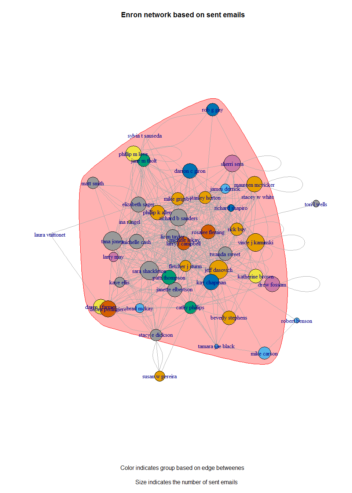

# Enron Network



##  What is it about?
We decided to use the Enron data set to explore the social network part of it. At this point 
we use hadoop mapreduce to compute the number of sent, recieved emails per person and all the recipients of the emails. Code is in appendix. Using this data we will be able to visualize the social network grouped by the metrics such as edge betwenness, centrality index, etc. 

We anticipate that the most challenging part of this project is the preprocessing of the unstructured data which is mostly done using regular expressions, python and linux shell. 

## How exactly will we implement the technical approach?
We will use hadoop mapreduce to preprocess and group the data. Afterwards, we will continue working in R and Python to do the visualizations. Below you can see an example of working with the data already preprocessed and grouped using hadoop. In Appendix you can the `mapper.py` and `reducer.py` files.


```r
# read number of connections by employee
nconns = read.delim("data/n-conns.txt")
names(nconns) = c("name","nconns")
nconns = nconns[order(nconns$nconns, decreasing = T),]
rownames(nconns) = 1:nrow(nconns)
head(nconns, n=10)
```

```
##                 name nconns
## 1      jeff dasovich   1346
## 2         tana jones   1238
## 3         sally beck   1116
## 4    sara shackleton   1066
## 5   vince j kaminski   1016
## 6           kay mann    939
## 7  richard b sanders    720
## 8       gerald nemec    719
## 9        sherri sera    680
## 10     chris germany    673
```

# Appendix

## Run hadoop to compute number of emails sent
My working directory is `workspace`. Enron email data is in `workspace/data/enron-emails`. Mapper, reducer are in the `workspace/enron-emails` folder. I save the results of mapreduce in `workspace/enron-emails/out`.

```
[cloudera@vivekoba workspace]$ pwd
/home/cloudera/workspace
[cloudera@vivekoba workspace]$ ls
averagewordlength     data          facebook   wordcount
avgwordlength-python  enron-emails  README.md
```
Before we upload the sent emails of each employee we must append the name of the employee to the email files names, so that there is no conflict because of files with identical names. To do that we run a shell script below.

**emails-rename.sh**
```
#!/bin/bash
# http://stackoverflow.com/questions/643372/append-name-of-parent-folders-and-
# subfolders-to-the-names-of-the-multiple-files/643443

for f in `find data/enron-emails/*/sent/ -name '*'`
do
   filename=`echo $f|awk -F'/' '{SL = NF-1; TL = NF-2; print $TL "_" $SL  "_" $NF}'`
   cp $f data/enron-emails-sent/$filename
done
```
Run this bash script and save results in `workspace/data/enron-emails-sent`.

```
[cloudera@vivekoba workspace]$ sh emails-rename.sh
cp: omitting directory `data/enron-emails/allen-p/sent/'
cp: omitting directory `data/enron-emails/arnold-j/sent/'
cp: omitting directory `data/enron-emails/arora-h/sent/'
cp: omitting directory `data/enron-emails/bass-e/sent/'
cp: omitting directory `data/enron-emails/beck-s/sent/'
cp: omitting directory `data/enron-emails/benson-r/sent/'
...

[cloudera@vivekoba workspace]$ ls data/enron-emails-sent|head -n 5
allen-p_sent_1.
allen-p_sent_10.
allen-p_sent_100.
allen-p_sent_101.
allen-p_sent_102.
...
```
Now, that we have properly and uniquely named files we can upload the data to the hadoop cluster.
```
[cloudera@vivekoba workspace]$ hadoop fs -mkdir enron-sent
[cloudera@vivekoba workspace]$ hadoop fs -put data/enron-emails-sent/* enron-sent
[cloudera@vivekoba workspace]$ hadoop fs -ls enron-sent | head -n 5
Found 58829 items
-rw-r--r--   1 cloudera cloudera       1126 2016-05-02 11:25 enron-sent/1.
-rw-r--r--   1 cloudera cloudera        478 2016-05-02 11:25 enron-sent/10.
-rw-r--r--   1 cloudera cloudera        960 2016-05-02 11:25 enron-sent/100.
-rw-r--r--   1 cloudera cloudera       1043 2016-05-02 11:26 enron-sent/1000.
...
```
The first statistic we try to calculate is number of unique connections per employee. Below are the mapper and the reducer.

**mapper.py**
```python
#!/usr/bin/python

####################
# Sample email

# Message-ID: <22646222.1075857437613.JavaMail.evans@thyme>
# Date: Wed, 13 Dec 2000 04:05:00 -0800 (PST)
# From: fletcher.sturm@enron.com
# To: frank.hayden@enron.com
# Subject: Re: Westpower Web site
# Mime-Version: 1.0
# Content-Type: text/plain; charset=us-ascii
# Content-Transfer-Encoding: 7bit
# X-From: Fletcher J Sturm
# X-To: Frank Hayden
# X-cc: 
# X-bcc: 
# X-Folder: \Fletcher_Sturm_Dec2000\Notes Folders\Sent
# X-Origin: Sturm-F
# X-FileName: fsturm.nsf

# Lloyd will
#####################

import sys
import re

sender = None
recievers = []

count = 0
# input comes from STDIN (standard input)
for line in sys.stdin:
	# remove leading and trailing whitespace
	line = line.strip().lower()
	if "x-from:" in line:
	    # split the line into sender and reciever list
	    sender = re.split(r'x-from:', line)[1].strip()

	if "x-to:" in line:
		recievers = re.sub("x-to:", "", line).strip()
		recievers = re.split(r',', recievers)
		recievers = [x.strip() for x in recievers]
		
	if sender is not None and len(recievers)>0:
		# print '%s\t%s' % (constant - len(recievers),sender)
		print '%s\t%s' % (sender, recievers)
		# print '%s\t%s' % (sender, len(recievers))
		sender = None
		recievers = []
```
**reducer.py**
```python
#!/usr/bin/env python

########################################
# Mapper.py output

# ina rangel      ['amanda huble']
# ina rangel      ['arsystem@mailman.enron.com @ enron']
# ina rangel      ['information risk management']
# ina rangel      ['john j lavorato']
# phillip k allen ['8774820206@pagenetmessage.net']
# phillip k allen ['alan comnes']
# phillip k allen ['al pollard']
# phillip k allen ['al pollard']
# phillip k allen ['al pollard']
# phillip k allen ['al pollard']
# phillip k allen ['al pollard']
# phillip k allen ['andrea richards']
# phillip k allen ['andrea richards']
# phillip k allen ['andrea richards']
#########################################

import sys
import re

key = None
total_rec = 0
all_recievers = []

# input comes from STDIN
for line in sys.stdin:
	parts = line.split("\t")
	newkey = parts[0]
	recievers = re.sub(r'\[|\]',"",parts[1])
	recievers = recievers.split(',')
	all_recievers += recievers
	
	if not key:
		key = newkey

	if key != newkey:
		print key + '\t' + str(len(set(all_recievers)))
		key = newkey
		all_recievers = []

if key != None:
	print key + "\t" + str(len(set(all_recievers)))
```
Let's test it on a small sample of emails sent by Phillip Allen.
```
[cloudera@vivekoba workspace]$ cd enron-emails
[cloudera@vivekoba enron-emails]$ cat ../data/enron-emails/allen-p/sent/* \
|python mapper.py|sort|python reducer.py

ina rangel	5
phillip k allen	263
```
In total we have data for 150 employees, but Phillip has 263 unique connections.  It is because there are emails sent to people outside the Enron company. Let's run the hadoop job and save the result as `nconns.txt`.
```
[cloudera@vivekoba enron-emails]$ hadoop jar \ 
/usr/lib/hadoop-mapreduce/hadoop-streaming.jar -input enron-sent \ 
-output enron-sent-out -file mapper.py -file reducer.py \ 
-mapper mapper.py -reducer reducer.py
[cloudera@vivekoba enron-emails]$ hadoop fs -cat enron-sent-out/* > out/nconns.txt
```
It takes a lot of time to complete. Alternatively, you could run the sample test code above on all data which will be quicker than a hadoop mapreduce job with one worker node. We save the data in the `out` folder as `nconns.txt`.

```
[cloudera@vivekoba enron-emails]$ cat ../data/enron-emails/allen-p/sent/*\ 
|python mapper.py|sort|python reducer.py > out/nconns.txt
```

## Run hadoop to get all connections
To visualize the network we run another mapreduce job with the output being `EmployeeName<TAB>[List of email recipients]` which we later further preprocess in R and visualize. To get the connections we use a different reducer.

**reducer2.py**
```python
#!/usr/bin/env python

########################################
# Mapper.py output

# ina rangel      ['amanda huble']
# ina rangel      ['arsystem@mailman.enron.com @ enron']
# ina rangel      ['information risk management']
# ina rangel      ['john j lavorato']
# phillip k allen ['8774820206@pagenetmessage.net']
# phillip k allen ['alan comnes']
# phillip k allen ['al pollard']
# phillip k allen ['al pollard']
# phillip k allen ['al pollard']
# phillip k allen ['al pollard']
# phillip k allen ['al pollard']
# phillip k allen ['andrea richards']
# phillip k allen ['andrea richards']
# phillip k allen ['andrea richards']
#########################################

import sys
import re

def replace_sqbr(x):
	# erases square brackets from string
	return(re.sub(r'\[|\]',"",x))

key = None
total_rec = 0
all_recievers = []

# input comes from STDIN
for line in sys.stdin:
	parts = line.split("\t")
	# newkey = re.sub(ur'[^(]*(\<.*\>)[^)]*$','',parts[0])
	newkey = parts[0]
	recievers = replace_sqbr(parts[1])
	recievers = recievers.split(',')
	# remove brackets and content inside, ex.g. name <name@email.com> -> name
	recievers = [re.sub(ur'[^(]*(\<.*\>)[^)]*$','',x).strip() for x in recievers]
	all_recievers += recievers
	
	if not key:
		key = newkey

	if key != newkey:
		conns = [x for x in set(all_recievers) if x != ""]
		print key + '\t' + replace_sqbr(str(conns))
		key = newkey
		all_recievers = []

if key != None:
	print key + "\t" + replace_sqbr(str([x for x in set(all_recievers) if x != ""]))

```

Let's run the hadoop job and save the results in the `workspace/enron-emails/out/conns.txt` file.
```
[cloudera@vivekoba enron-emails]$ hadoop jar \ 
/usr/lib/hadoop-mapreduce/hadoop-streaming.jar -input enron-sent \ 
-output enron-sent-cons -file mapper.py -file reducer2.py \ 
-mapper mapper.py -reducer reducer2.py
[cloudera@vivekoba enron-emails]$ hadoop fs -cat enron-sent-cons/* > out/conns.txt

```
